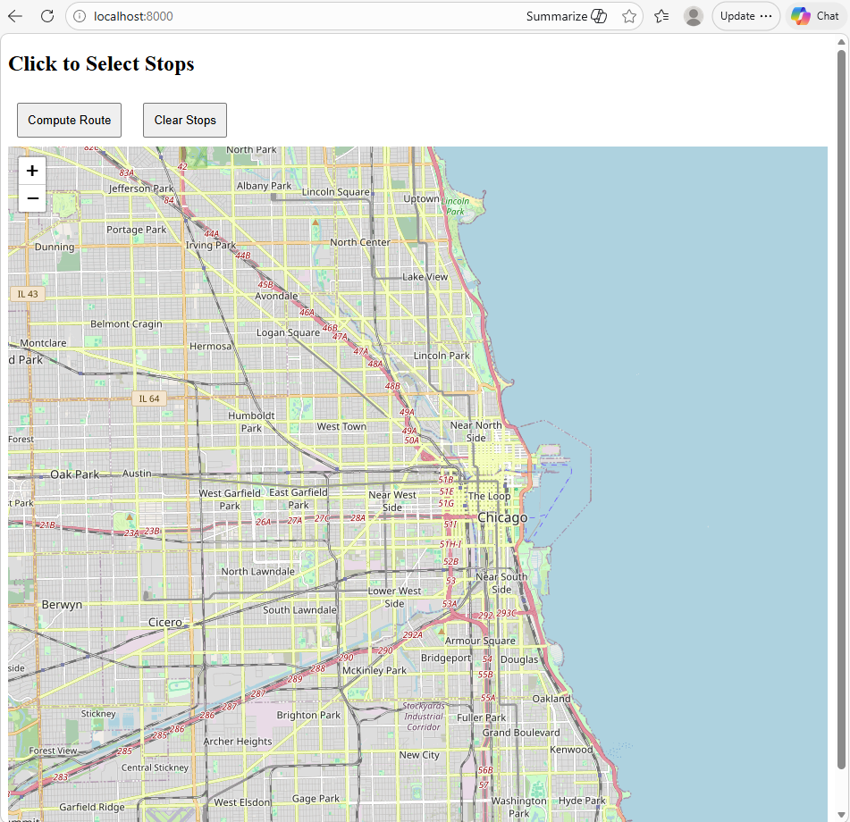
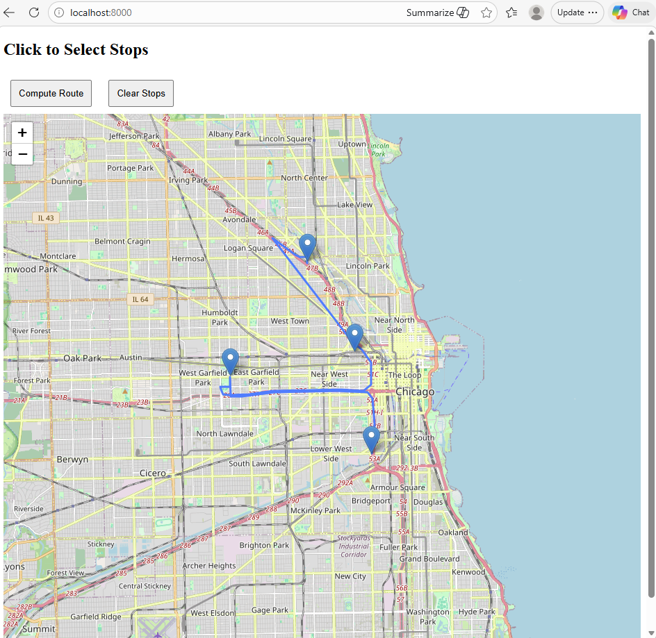
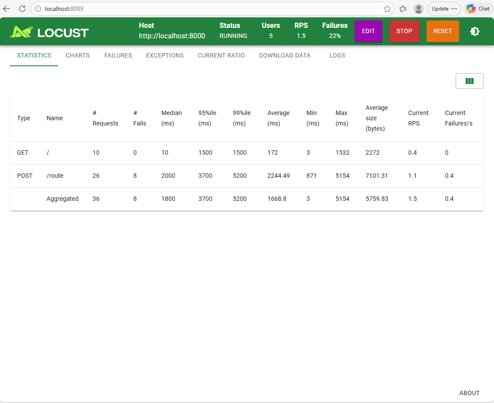

# Route Optimizer API 
A containerized FastAPI backend service that computes optimized routes across a preloaded city road network using a custom A* routing algorithm.

The service loads a road graph into memory and calculates efficient routes between user-selected stops. The project focuses on backend performance, concurrency, and production-style deployment practices.

## Project Focus
- Backend systems design
- Data Structures and Algorithms
- Concurrency
- Containerization (Docker)
- Load testing
- Performance measurement

## Project Structure
- routing/ – Core routing algorithms (A*, distance matrix computation, heuristic functions)
- app/ - API endpoint, FastAPI, JSON request / response templates

## How to Run
### Local Method
Install Dependencies:
pip install -r requirements.txt

Run Server:
uvicorn app.main:app 

Open In Browser:
http://localhost:8000

### Docker Method
Build Image:
docker build -t route-api .

Run Container:
docker run -p 8000:8000 route-api 

## Load Testing 
The project includes Locust for stress testing the API under concurrent traffic.

Example Command:
locust --host http://localhost:8000

## Future Improvements
- AWS EC2 deployment
- Nginx reverse proxy
- Monitoring and observability

## Demo Screenshots

